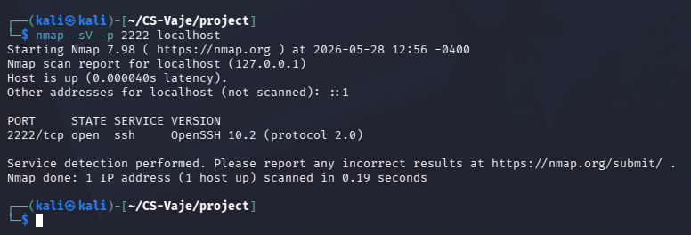
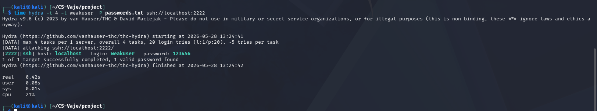
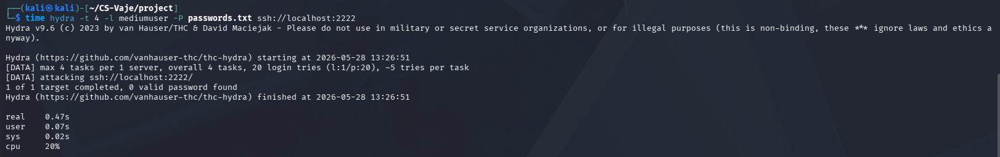
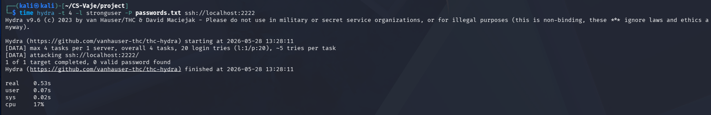
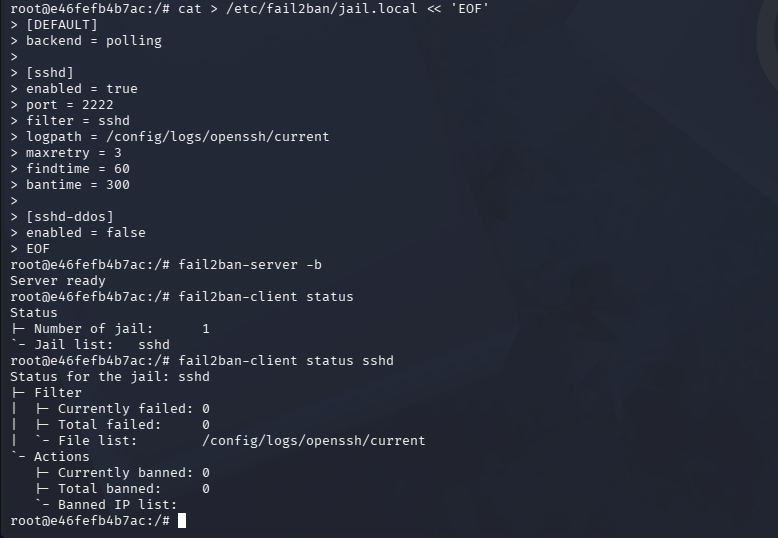
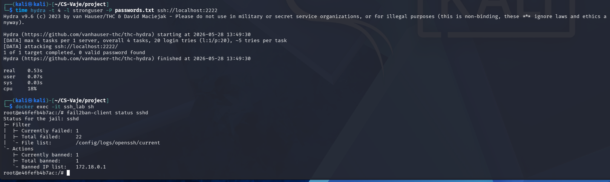

# SSH Brute-Force Attack Analysis

## 1. Introduction
Secure Shell (SSH) is one of the most commonly used protocols for remote admin work and secure communication between systems. SSH often provides a direct access to servers and is for that reason a frequent target for brute force attacks. In these attacks the attack repeatedly guesses login credentials by trying a large number of usernames and passwords. Usualy this is done with automated tools and publicly available password dictionaries. Weak and common passwords increase the risk of succesful attacks. Modern systems often use additional defensive mechanisms like rate limiting, intrusion detection or automated banning systems like fail2ban.

The goal of this project was to simulate and analyze SSH brute force attacks using Kali Linux and Docker containers. The project included reconnaissance using Nmap, brute-force attacks against multiple user accounts with varying password strength, and the implementation of fail2ban as a defensive mechanism against repeated failed login attempts.

All testing was performed in an isolated local environment.
## 2. Methodology
### Environment
The project was done in a virtual environment using Oracle VirutalBox. A Kali Linux machine was used as the attacking system and Docker was installed inside the Kali VM to host the targeted SSH.

The container exposed the SSH service on port 2222 of the local  host machine.
### Tools Used
Several tools were used throughout the project:

- Nmap – used for reconnaissance and service detection.
- Hydra – used to perform automated SSH brute-force attacks.
- Docker – used to create and manage the isolated SSH target environment.
- fail2ban – used as a defensive mechanism against repeated failed login attempts.
- VirtualBox – used to host the Kali Linux virtual machine.
### Setup
The Docker container was started using the provided docker-compose configuration from the course repository.

Three user accounts with different password strengths were configured inside the SSH container:

| Username | Password | Password Strength |
|---|---|---|
| weakuser | 123456 | Weak |
| mediumuser | Password123 | Medium |
| stronguser | Str0ng!Pass#2026 | Strong |

The provided password list (passwords.txt) was used as the dictionary for Hydra attacks.
## 3. Experiment

### Reconnaissance
Before performing brute-force attacks, reconnaissance was performed using Nmap in order to identify the running service and verify that the SSH server was accessible. The following command was used:

nmap -sV -p 2222 localhost

The scan confirmed that the SSH service was running on port 2222.

### Weak Password Attack
The first attack targeted the weakuser account, which used a common and weak password "123456".

This command was used for the attack (Hydra):

time hydra -t 4 -l weakuser -P passwords.txt ssh://localhost:2222

Hydra successfully identified the correct password almost immediately. With the attack we demonstrated how weak and common passowrds can be compromised quickly using dictionary attacks.

### Medium Password Attack
The second attack targeted the mediumuser account using the password Password123.

This command was used for the attack (Hydra):

time hydra -t 4 -l mediumuser -P passwords.txt ssh://localhost:2222

The attack was unsuccessful because the password was not included in the provided password list. Hydra attempted all passwords from the list and failed to authenticate successfully.

### Strong Password Attack
The third attack targeted the stronguser account, which used the password Str0ng!Pass#2026.

This command was used:

time hydra -t 4 -l stronguser -P passwords.txt ssh://localhost:2222

Similarly to the previous attack, Hydra was unable to uncover the password because the password was not included in the dictionary used in the attack and is much more complex then other weaker passwords.

### fail2ban Protection
At the end, fail2ban was installed and configured inside the Docker container in order to protect the SSH service from repeated failed login attempts.

The installation was performed using this commands:

apk update
apk add fail2ban

A custom jail.local configuration was created to monitor SSH logs and automatically ban IP addresses after repeated failed authentication attempts.

After enabling fail2ban, the same Hydra attacks were performed again. The system successfully detected repeated failed login attempts and automatically banned the attacking IP address.

## 4. Results
The attacks clearly demonstrated a difference in attack success depending on password strength and the presence of defensive mechanisms.

The weak password was compromised almost instantly because it was included in the provided password list as it is a commonly used and simple password. Passwords of the medium and strong user were not included in the password list and were not compromised with Hydra.

After fail2ban was enabled the repeated failed login attempts were detected automatically. The attacking IP was correctly banned after going over the configured retry limit. This in a real world scenario can prevent further brute force attempts. This clearly demonstrated the importance of using automated intrusion prevention systems againts brute force attacks.

In this table are summarized attack results:

| Configuration | Protection | Result | Execution Time | Attempts |
|---|---|---|---|---|
| weakuser / 123456 | None | Successful compromise | 0.42 s | 1 |
| mediumuser / Password123 | None | Attack unsuccessful | 0.47 s | 20 |
| stronguser / Str0ng!Pass#2026 | None | Attack unsuccessful | 0.53 s | 20 |
| stronguser / Str0ng!Pass#2026 | fail2ban enabled | IP address banned | 0.53 s | 22 |
## 5. Discussion
The attacks or the project demonstrated the importance of password strength / complexity and additional security mechanisms in protecting systems againts brute force attack in this case SSH services. Weak password such as "123456" were compromised without a problem even with using a small password list.

The medium and strong password configuration showed better resiliance againts dictionary brute force attacks. Even if the passwords were not extremly long or to complicated the fact that they were not included in the password list was enough to prevent a succesful attack. This shows that password uniqueness can significantly reduce the risk of brute force attacks.

However, password strength alone is not always sufficient protection. Attackers may use significantly larger password dictionaries, leaked credential databases or slow brute-force techniques designed to avoid detection. Because of this, additional defensive mechanisms are important for protecting exposed SSH services.

The implementation of fail2ban significantly improved the security of the targeted system. After repeated failed login attempts, the attacking IP address was automatically banned, preventing further attempts. This reduced the effectiveness of automated attacks and demonstrated the value of intrusion prevention and rate limiting mechanisms.

During the project several challenges were encountered while configuring the environment. The SSH server was hosted inside a minimal Alpine Linux Docker container, which required additional troubleshooting during user creation and fail2ban configuration. SSH logs were located manually before fail2ban could be used and configured correctly.

One limitation of this project is that the attacks were performed entirely in a local environment using a relatively small password dictionary. Real-world attackers may use much larger dictionaries, credential leaks, GPU-accelerated cracking systems or distributed attacks from multiple IP addresses. Additionally, the attacks focused only on password-based authentication and did not include stronger alternatives such as SSH key authentication or multi-factor authentication.

Several improvements could be made to strengthen the security of the tested SSH environment:

1. Disable password-based authentication and use SSH key authentication instead as SSH keys are significantly more resistant to brute-force attacks than traditional passwords.

2. Implement multi-factor authentication (MFA) for SSH access. Even if credentials are compromised, attackers would still require an additional information.

3. Restrict SSH access using firewall rules, VPN access, or IP whitelisting. Limiting which systems can connect to the SSH service greatly reduces risks.

Additional improvements could include changing the default SSH port, monitoring authentication logs continuously, and using centralized intrusion detection systems.
## 6. Conclusion
This project demonstrated how SSH can be targeted using automated brute-force attacks and how password strength and defensive mechanisms influence attack success. Weak passwords were compromised almost instantly, while medium and strong passwords resisted the dictionary-based attacks performed with Hydra.

The implementation of fail2ban additionally improved security by automatically detecting and blocking repeated failed login attempts. This showed the importance of combining strong passwords with additional protection mechanisms rather than relying on passwords alone.

Overall, the project provided practical experience with Kali Linux, Docker, Hydra, SSH services, and fail2ban, while demonstrating the importance of security in protecting remote access services.